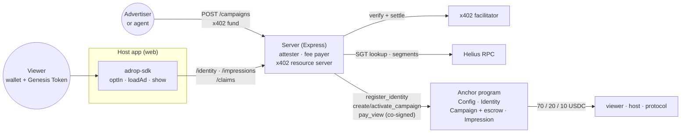
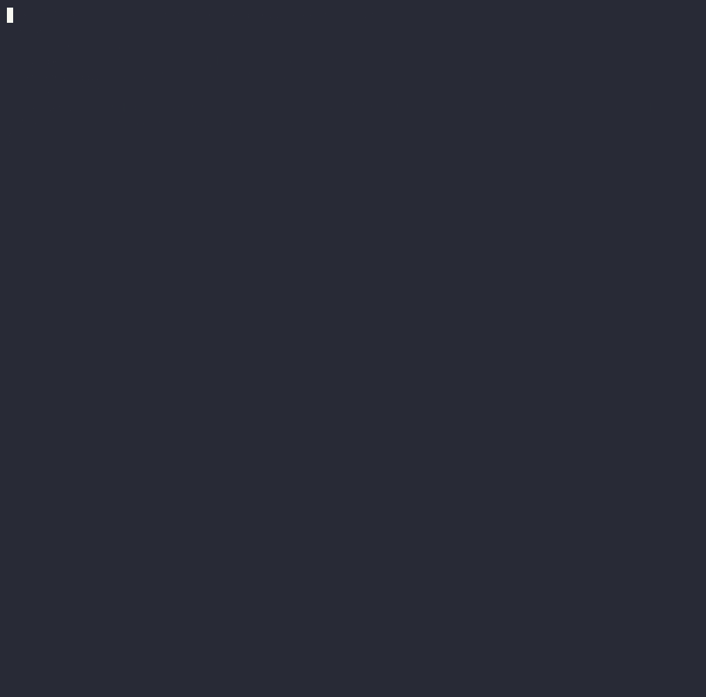

# Adrop

The plug-in ad network for Web3 apps. A host app adds one line of code; an agency funds one
campaign and it reaches every app on the network. Users opt in with a wallet signature and a
proof of personhood (on Solana, the Seeker Genesis Token); every qualified view pays the person
and the host app in USDC straight from the campaign's escrow (devnet split 70% viewer, 20% host,
10% protocol). Agencies, human or AI agent, fund campaigns with one HTTP request over
[x402](https://x402.org). No token, no wallet lists: buyers get verified reach, never addresses.

Built for the Colosseum Crypto World's Fair, October 2026. Solana devnet.
Website: [adrop.sh](https://adrop.sh). Docs: [docs.adrop.sh](https://docs.adrop.sh) (source in `docs/`). Demo: [demo.adrop.sh](https://demo.adrop.sh).
X: [@AdropProtocol](https://x.com/AdropProtocol).

## Architecture


One view: the SDK registers the identity once, asks the server for an impression (one-time nonce,
campaign the identity is in), measures attention (≥50% visible for the dwell time, focused, pointer
event), then sends the claim. The server verifies, builds `pay_view`, co-signs as attester and fee
payer; the viewer signs; the program re-checks identity, audience Merkle proof, nonce, daily cap and
escrow, and pays all three in one transaction. Details: `docs/how-it-works.md`, `docs/protocol.md`.

An agent funding a campaign over x402 (create → `402` → pay → `active`):



## Layout
```
programs/adrop/    Anchor program: identities, campaigns, escrow, pay_view
packages/shared/   constants, Merkle helpers shared by server and SDK
packages/sdk/      adrop-sdk, framework-free web build (ESM + IIFE)
apps/server/       Express: x402 funding, impressions, claims, attester
apps/demo-web/     Next.js host app that integrates the SDK like a third party would
infra/             docker-compose, Caddy, .env.example, docs image
docs/              public docs (MkDocs Material → docs.adrop.sh): SDK, API, protocol, identity, DISCLOSURE.md
```

## Run
Requirements: Node 20, pnpm 9, Rust, Solana CLI 2.x, Anchor 1.2 (`avm`), a Helius devnet key.

```sh
pnpm install
pnpm build:program && pnpm idl     # Anchor build, copy IDL into packages/shared
pnpm test                          # Anchor tests on a local validator
pnpm test:unit                     # server (supertest) and SDK (vitest)
```

Devnet, once (env vars as in `infra/.env.example`; attester and fee payer are separate keypairs):
```sh
pnpm devnet:init                   # mock Genesis Token group, treasury account, program initialize
pnpm sgt:mock <wallet> <group>     # mint a mock Genesis Token to a viewer wallet
pnpm register:demo                 # register the demo viewer through the server
pnpm seg:build                     # segment index (dex_swap_30d) → audience roots
FREQ_CAP=10 pnpm fund:demo [serverUrl] [advertiser]   # create a campaign and pay it over x402
```

Serve: `pnpm --filter @adrop/server dev` (port 3000) and `pnpm --filter @adrop/demo-web dev` (port 3001), or
`docker compose up -d` in `infra/` (server, web, Caddy with TLS). Docs preview: `mkdocs serve`.

## Licence
Apache-2.0, see `LICENSE`. Reused code is listed in `docs/DISCLOSURE.md`.
